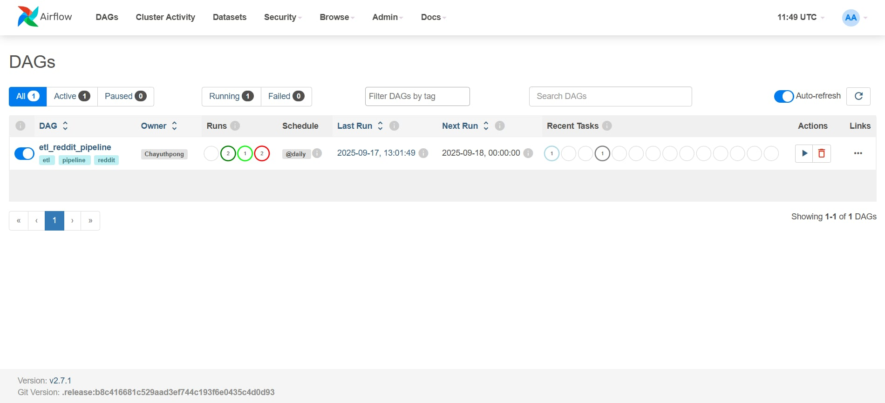
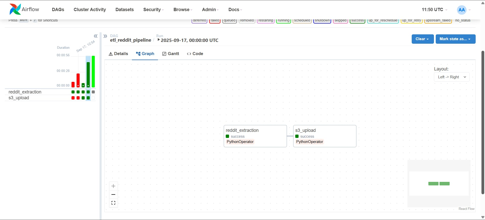

# Reddit Data Engineering Project

## Overview

This project focuses on building data pipeline Reddit data. It begins with Apache Airflow, which orchestrates data ingestion using PostgreSQL and Celery. The data is then stored in Amazon S3 on raw bucket and use AWS Glue job transformed data into transformed bucket.

AWS Glue automatically manages the ETL process and updates the Data Catalog. Finally, Amazon Athena is used to perform fast and efficient queries directly on the data in S3, enabling powerful data analysis.

## Table of Contents
- [Overview](#overview)
- [Architecture](#architecture)
- [Dataset Used](#dataset-used)
- [Step in This Project](#step-in-this-project)
- [Results](#results)

## Architecture

### Tech Stacks
Programming Language - Python
workflow orchestration - Apache Airflow & Celery
Database - PostgreSQL

Amazon Web Service (AWS)
1. AWS S3 Bucket
2. AWS Glue
    1. AWS Glue Crawler
    2. AWS Glue Catalog
3. Amazon Athena

## Dataset Used
Reddit API is an Application Programming Interface that allows developers to access and interact with Reddit's data programmatically.

The API provides methods to access specific data points, including:
1. Subreddits: Retrieve information about subreddits, such as popular, new, or specific subreddit details
2. Posts: Access data from individual posts, including titles, content, authors, and vote counts.
3. Comments: Fetch comments associated with a post, along with their content, authors, and votes.

By using the API, developers can automate the process of gathering large-scale data, making it ideal for data analysis projects and building applications that integrate with the Reddit platform.

More info about dataset :
1. Document - https://github.com/reddit-archive/reddit/wiki/OAuth2
2. How to get start - https://www.reddit.com/r/reddit.com/wiki/api/

## Step in This Project
1. Create App and building ETL pipeline using data from reddit API 
2. Create ETL dag and move it to airflow
3. Store data into AWS S3 raw bucket
4. Transform data using AWS Glue job and Crawler
5. Store transformed data into AWS S3 transformed bucket
6. Create database using AWS Glue data catalog
7. Query and analysis using Amazon Athena

## Results
1. Move dag to airflow

2. Pipeline dage

3. Run Pipeline

5. Store data in raw bucket

6. Transformed data using AWS Glue job

7. Store data in transformed bucket 

8. Create database using AWS Catalog

9. Query data using Amazon Athena
